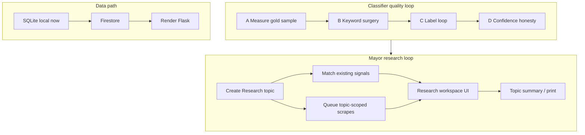

# CivicPulse — 2-month roadmap (pre-alpha → demoable alpha)

**Canonical copy** of the Cursor plan “Two month roadmap.”  
Day-to-day session prompts live in [`SESSION_PLAN.md`](../SESSION_PLAN.md) (not this file).

**Last updated:** 2026-07-20 — Research workspace + Firestore-before-Render + **classifier quality loop** (wrong categories / misleading high confidence).

---

## Capacity reality check

| | |
|--|--|
| **Team** | 2 people × ~3 sessions/week × ~2 hours ≈ **~12 person-hours/week** ≈ **~96 hours / 8 weeks** |
| **Pace rule** | One vertical slice per session. Prefer soak/QA over rushing the next milestone. |
| **Session 1 lesson** | Platform harden + UI polish landed fast; remaining work is heavier (Firebase + Research + **labels**). |

**Foundation today:** Flask `backend/`, **SQLite**, auth/jobs/signals/reports/votes, keyword + Naive Bayes classifier (`scrapers/classifier.py` + `data/labels/labeled_signals.json` ≈ **142** examples), dashboard/map/report UI, TikTok **desktop** scrape.

**Why Firebase before Render:** Render’s filesystem is **ephemeral** — SQLite on disk will not survive deploys. Hosted store = **Firestore** (not Postgres). See [Data platform](#data-platform-sqlite--firebase--render).

**Why classifier work is on the critical path:** Research (“housing prices”) and the mayor demo both **trust categories**. Wrong labels + high % confidence destroy trust. More scrapes without a label loop only multiplies mistakes.

---

## Product north star (week-8 “done”)

A **logged-in mayor-office demo** (Firestore locally; **Render + Firestore** hosted) that:

1. Shows **live DB-backed** signals with **believable** categories (not obviously wrong + fake-high confidence)
2. Lets staff **create a Research** on a topic (e.g. “housing prices”) that:
   - **Searches the archive** (existing signals already ingested)
   - **Pulls new material** via topic-scoped scrape/import jobs
   - Presents a **workspace**: archive vs newly gathered
3. Keeps feed, map, resident reports/votes, scrape panel
4. Produces a **research summary** (topic briefing) for a mayor handout
5. TikTok stays **operator desktop** (not Selenium-on-Render)

**Deferred if time slips:** full resolution workflow, citywide daily briefing, map clustering v2, Firebase Auth, hotline, cloud TikTok, vector/embedding search (Phase E only if needed).

---

## Classifier quality loop (phases A–E)

**Current system (do not rewrite first):**

- Keyword pass in `scrapers/categories.py` — one hit often starts confidence ≈ **0.7**
- Naive Bayes in `scrapers/classifier.py` trained on `data/labels/labeled_signals.json` (~**10–14 examples/category**)
- UI **confidence is not calibrated accuracy** — high % next to a wrong category is common when a broad keyword fired

**Strategy:** error-driven labeling + keyword hygiene. **Not** “scrape more and hope.” Architecture upgrades only in Phase E if A–C plateau.

### Phase A — Measure (gold sample)

**Goal:** Know *how* classification fails before changing code.

- Pull a fixed sample of **~50–100** live signals (mix of sources).
- For each: mark **correct / wrong / should-be-none**; note `method` (`keywords`, `model`, `keywords+model`, `inherited`, `outlet_default`) and matched keyword if obvious.
- File results as a simple sheet or `data/labels/review_batch_YYYYMMDD.md` (wrong IDs + notes).
- Summarize top failure modes (e.g. “`noise` too broad”, “housing vs apartment ads”).

**Exit:** Written failure list + gold sample you can re-score after every change.

### Phase B — Keyword surgery (high ROI)

**Goal:** Kill the worst false positives in `CATEGORY_KEYWORDS`.

- Tighten/remove single-token / overly broad terms; prefer multi-word phrases.
- Re-run `python scripts/reprocess_signals.py` (+ import/sync so DB matches).
- Re-score the **same** gold sample; keep a short before/after tally.

**Exit:** Measurable drop in gold-sample false positives; no new model architecture.

### Phase C — Label loop (ongoing)

**Goal:** Grow supervision where the model is weak.

- For wrong cases, add hand-labeled rows to `labeled_signals.json` (true categories **or empty = none**).
- Prefer **hard/error cases** and **negatives**, not more easy “pothole on Culver” clones.
- Target over the 2 months: toward **~30–50 examples per category** + a healthy **none** set (from ~10–14 today).
- After each batch: reprocess → re-check gold sample → commit labels + keyword tweaks together when possible.

**Exit (rolling):** Label count up; gold-sample accuracy trending up; Research archive demos stop looking random.

### Phase D — Confidence honesty (product / UI)

**Goal:** Stop the UI from implying false precision.

- Treat displayed confidence as **match strength**, not “probability correct.”
- Always surface **method** (and inherited/outlet-default clearly).
- Prefer softer copy for keyword-only; optional: hide bare % until calibrated.
- Do **not** invent a new scoring formula until Phase A sample exists.

**Exit:** Demo audience isn’t misled by “92%” on a bad label.

### Phase E — Only if A–C plateau (month 3 default)

- Stronger model / embeddings / vector retrieval — **out of default 2-month scope**.
- Revisit only if gold sample still fails Research demos after solid labels + keywords.

---

## What “Research” means (product contract)

### Mayor story

> “I want to research **housing prices** in Irvine.”  
> CivicPulse creates a Research, scans **what we already have**, kicks off **new** news/social pulls aimed at that topic, and shows one place to read findings.

### Research object (minimum fields)

| Field | Purpose |
|-------|---------|
| `id`, `title` | Display name (“Housing prices — Jul 2026”) |
| `topic` | Free-text topic / question |
| `keywords[]` | Search terms (auto-suggested + editable) |
| `categories[]` | Civic categories from classifier (`housing`, …) |
| `status` | `draft` → `gathering` → `ready` → `stale` |
| `created_by`, timestamps | Audit |
| `job_ids[]` | Linked scrape/import jobs |
| `notes` | Optional staff notes |

### Two gathering modes

1. **Archive pass** — match existing signals by category overlap + keyword hit in title/body; persist `research_hits`.  
   *Depends on Phase B/C so “housing” isn’t full of sanitation noise.*
2. **New ingest** — topic-scoped news/import/TikTok-desktop jobs; attach matching new signals when jobs sync.

### Workspace UI (v1)

List / detail / Archive tab / New tab / job status / refresh archive / print summary.

### Out of scope for Research v1

Embeddings, cloud TikTok, multi-city, LLM chat literature review.

---

## Data platform: SQLite → Firebase → Render

| Decision | Choice |
|----------|--------|
| Hosted DB | **Cloud Firestore** |
| App server | **Flask on Render** (gunicorn) |
| Auth (2-month) | **Flask sessions** (Firebase Auth = stretch) |
| Local SQLite | Through Week 2 (+ tests fallback) |
| Postgres | **Not the path** |

**Migration shape:** store interface → Firestore impl (`DATA_BACKEND=firestore`) → export script → cut over local → Render with service-account env → pytest via emulator/mocks.

**Risks:** Firestore ≠ SQL full-text; design archive matching for Firestore constraints in Week 3; never commit service-account JSON.

---

## Progress snapshot

### Shipped — Week 1 Session 1 (2026-07-20)

- [x] SQLite `/api/signals`, runbook, TikTok desktop docs
- [x] Reports + votes APIs, UI polish, pytest for new APIs

### Open next

- [ ] Week 1 Sessions 2–4: soak, UX harden, **Phase A measure** (+ light test debt)
- [ ] Week 2: **Phases B–D** + Research spike
- [ ] Weeks 3–8: Firebase → Research full → summary/demo (with ongoing Phase C)

---

## Week-by-week plan (session-grained)

~3 sessions/week. Each: merge + `pytest -q` → one milestone → update this file or `SESSION_PLAN.md`.

### Week 1 — Stabilize + start measuring classification

| Session | Focus | Exit |
|---------|--------|------|
| **1** | Platform harden + UI polish | **Done** |
| **2** | Cold-start soak + smoke checklist | Coworker demos in &lt;15 min from docs |
| **3** | Dashboard empty/loading/error + scrape failures | Graceful failure if API down |
| **4** | **Phase A** gold sample (~50–100) + light test debt | Failure-mode notes + reusable review list |

**Do not start Firebase or Research UI in Week 1.**

### Week 2 — Classifier fix loop + Research spike (SQLite)

| Session | Focus | Exit |
|---------|--------|------|
| **5** | **Phase B** keyword surgery + reprocess; start **Phase D** (method + honest confidence copy) | Gold sample false positives down; UI less misleading |
| **6** | **Phase C** label batch #1 (errors + none) + reprocess | Labels committed; gold sample re-checked |
| **7** | Research model + `POST/GET /api/researches` (SQLite) | Create/list research in API + minimal UI |
| **8** | Archive matcher → `research_hits` + retro (Firestore schema sketch) | “Housing” research mostly sensible hits; Session 9 owner named |

**Week 2 exit:** Classification visibly less embarrassing on the gold sample; mayor can create a research and see **archive** hits that aren’t random.

### Weeks 3–4 — Firebase, then Render (Person B keeps Phase C)

| Session | Focus | Exit |
|---------|--------|------|
| **9** | Firestore project + emulator docs | README: run emulator |
| **10** | Store interface + Firestore `signals` | `/api/signals` with `DATA_BACKEND=firestore` |
| **11** | Port users, jobs, votes, reports | Login/vote/jobs on Firestore |
| **12** | Port researches + hits; SQLite→Firestore export | Research still works |
| **13** | Cut over local demo to Firestore | Cold demo on Firestore |
| **14** | Render + Firebase credentials | Public URL loads login |
| **15** | Seed/import on hosted; desktop-only Selenium messaging | Clear TikTok story on server |
| **16** | CI + buffer; **Phase C** batch #2 if gold sample still weak | PR checks green |

**Weeks 3–4 exit:** Render + Firestore; Research archive path works; SQLite not required in prod.

### Weeks 5–6 — Research workspace full loop (+ ongoing labels)

| Session | Focus | Exit |
|---------|--------|------|
| **17–18** | Research workspace UI (list/detail, archive/new, status) | Staff drives research without API tools |
| **19–20** | Topic → keyword assist + category picker; **Phase C** batch #3 on research false hits | Creating “housing prices” feels guided |
| **21–22** | Wire news/import jobs to research; auto-attach matching signals | New tab fills after a news job |
| **23–24** | TikTok/desktop job link + operator copy in UI | Pending desktop scrape without hanging Render |
| **Buffer** | Hit ranking, empty states, refresh archive | 5-minute mayor walkthrough works |

**Weeks 5–6 exit:** Create topic → archive hits → gather → new hits → open signals.

### Weeks 7–8 — Summary, honesty polish, demo freeze

| Session | Focus | Exit |
|---------|--------|------|
| **25–26** | Research **summary** API + print/HTML | One-pager for that topic |
| **27** | Map filter pins **by active research** | Geo view of research hits |
| **28** | **Phase D** polish pass (confidence/method UX) if demos still confuse | No “92% wrong” moments in script |
| **29–30** | Hardening, operator guide, seed for demo day; optional thin resolution | Rehearsal notes |
| **31–32** | Feature freeze + two full demo rehearsals | 10-minute mayor script without chaos |

**Phase E** only if gold sample still fails after batches — park for month 3 by default.

**Weeks 7–8 exit:** Demo centered on Research + trustworthy-enough categories; known bugs listed.

---

## What we are deliberately de-prioritizing

| Earlier idea | Now |
|--------------|-----|
| Render + **Postgres** | **Firestore** |
| Standalone daily city briefing | **Research summary** |
| Resolution + map clusters as Weeks 5–6 hero | Thin map-by-research; resolution optional |
| Firebase Auth weeks 7–8 | Stretch |
| Classifier rewrite / embeddings | **Phase E / month 3** unless blocked |
| Research as month-3-only | Weeks 2–8 |

---

## Role split (suggested)

| Person A (platform) | Person B (product / NLP / research UX) |
|---|---|
| Store interface, Firestore, Render, CI | **Phases A–C** (review, keywords, labels), Phase D copy |
| Jobs ↔ research linking | Research UI, archive matcher, summary/print |
| Emulator + secrets docs | Gold sample ownership, demo narrative |

Classifier quality is **Person B–led** but both re-score the gold sample after changes.

---

## Session rhythm

1. **15 min** — merge + `pytest -q` + glance at gold-sample regressions  
2. **80 min** — **one** milestone (platform **or** classifier **or** research — not all three)  
3. **15 min** — commit/PR, tick boxes, name next owner in `SESSION_PLAN.md`

---

## Explicit non-goals (month 3+)

- Hotline / call-transcript ingestion  
- Embedding / vector search (**Phase E** only if forced)  
- Always-on TikTok Selenium in the cloud  
- Multi-tenant / multi-city / native mobile  
- Pure Firebase client rewrite  

---

## Success metrics at week 8

- [ ] Cold demo on **Firestore** (local) and **Render**  
- [ ] **Gold sample** re-scored: clear improvement vs Phase A baseline (track wrong-rate)  
- [ ] Labels file grown meaningfully (directionally toward ~30+/category, not still ~12)  
- [ ] Mayor can **create a Research** with sensible **archive hits** for a topic like housing  
- [ ] ≥1 **new gather** path attaches signals into that research  
- [ ] Research **summary** printable without hand-editing  
- [ ] Confidence UI shows **method**; demo script doesn’t lean on fake precision  
- [ ] TikTok = desktop worker; server doesn’t hang  
- [ ] `pytest -q` green (CI if enabled)  

---

## Related docs

| File | Purpose |
|------|---------|
| [`SESSION_PLAN.md`](../SESSION_PLAN.md) | Next-session checklist / coworker prompts |
| [`INTEGRATION.md`](INTEGRATION.md) | API + CLI (`reprocess_signals`) |
| [`TIKTOK_SCRAPE.md`](TIKTOK_SCRAPE.md) | Desktop TikTok |
| [`BACKEND_PLATFORM_HANDOFF.md`](BACKEND_PLATFORM_HANDOFF.md) | Backend status |
| `data/labels/labeled_signals.json` | NB training labels (Phase C) |
| `scrapers/categories.py` / `scrapers/classifier.py` | Keywords + model (Phases B–C) |
| Cursor plan `two_month_roadmap_*.plan.md` | Short mirror — edit **this** file first |
